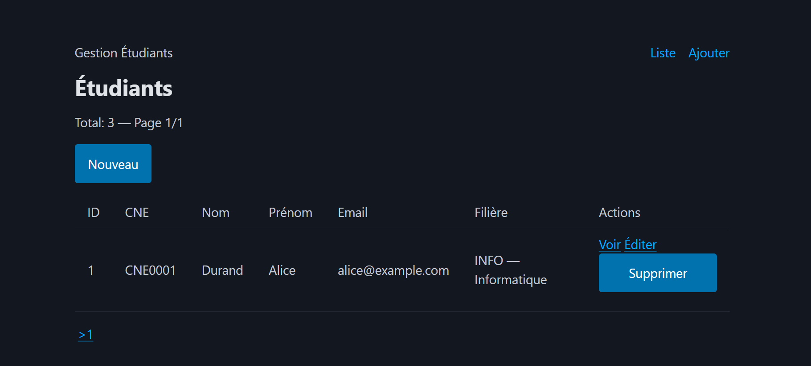

# LAB 7 — Mini-Framework MVC et Routing

## 📚 Cours
Ingénierie Logicielle Web avec PHP 7 : Architecture Multicouche et Accès aux Données Sécurisé

---

## 🎯 Objectif pédagogique

Ce LAB guide la construction d’un mini-framework MVC en PHP 7 pour un CRUD Étudiant avec pagination. Il suit un style Google Cloud Skills Boost : étapes progressives, actions concrètes, explications de code, validations et livrables. À la fin, obtenir une application web fonctionnelle, organisée par couches, avec un routeur GET/POST et des vues PHP dynamiques.
Points clés de ce LAB :
- Front Controller unique (public/index.php)
- Router simple (GET/POST + paramètres {id})
- BaseController avec render, redirect, json
- Vues PHP avec layout
- CRUD Étudiant + pagination ?page=1&size=5
- Tests des routes + fichier test_routes.md
- Optionnel : API JSON paginée
Durée cible : 2–3 heures. Niveau : Bac+2/Bac+3 (intermédiaire).
---

## ⚙️ Prérequis techniques

- PHP 7.x installé (CLI et serveur interne)
- MySQL/MariaDB accessible
- Notions POO, PDO, MVC, HTTP
- Navigateur moderne
- Éditeur de code (IntelliJ/PHPStorm/VSC)
Base de données :
- Nom : gestion_etudiants_pdo
- Tables :
```
  - filiere(id, code, libelle)
```
```
  - etudiant(id, cne, nom, prenom, email, filiere_id)
```

Réutilisation (depuis LAB 4/5 si disponible) :
- DBConnection, Logger, EtudiantDao, FiliereDao (optionnel : EtudiantService)
---

## 💻 Setup du projet

```
project-root/
  public/
    index.php
  src/
    Container/
      AppFactory.php
    Controller/
      BaseController.php
      EtudiantController.php
    Core/
      Router.php
      Request.php
      Response.php
      View.php
    Dao/
      DBConnection.php
      Logger.php
      EtudiantDao.php
      FiliereDao.php
  views/
    layout.php
    etudiant/
      index.php
      create.php
      edit.php
      show.php
  logs/  (écriture des logs)
  test_routes.md
```

## ▶️ Exemple d'exécution


